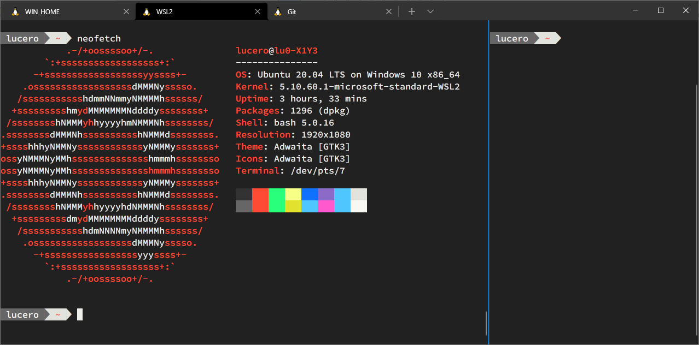

# Windows Terminal - Setup

This repository contains my setup for the [Windows Terminal](https://en.wikipedia.org/wiki/Windows_Terminal).
- Color Sheme
    - The same I use on [my Linux Dotfiles](https://github.com/lu0/dotfiles_linuxMint#terminal) and [my VSCode theme](https://github.com/lu0/vscode-theme-interplanetary-craft).
- Keybindings
    - The ones I use on [VSCode](https://github.com/lu0/vscode-settings).
        - Tab navigation
        - Pane navigation/resizing
        - Etc.
- Shell/Profile
    - I use WSL2 instead of CMD (must be installed).
- Font
    - [Source Code Pro](https://github.com/adobe-fonts/source-code-pro) (must be installed).
- Prompt
    - [My variation of Fancy Bash](https://github.com/lu0/dotfiles_linuxMint/blob/master/bash/fancy-bash.sh) (must be installed).



## Install
Close the Windows Terminal if open, then go to the Windows Terminal's settings folder:
```sh
cd /mnt/c/Users/<YOUR_WINDOWS_USER>/AppData/Local/Packages/Microsoft.WindowsTerminal_8wekyb3d8bbwe
```

And clone the repository under `LocalState`
```sh
git clone https://github.com/lu0/windows-terminal-setup LocalState
```

**Note**: You might need to modify the profile's guid.