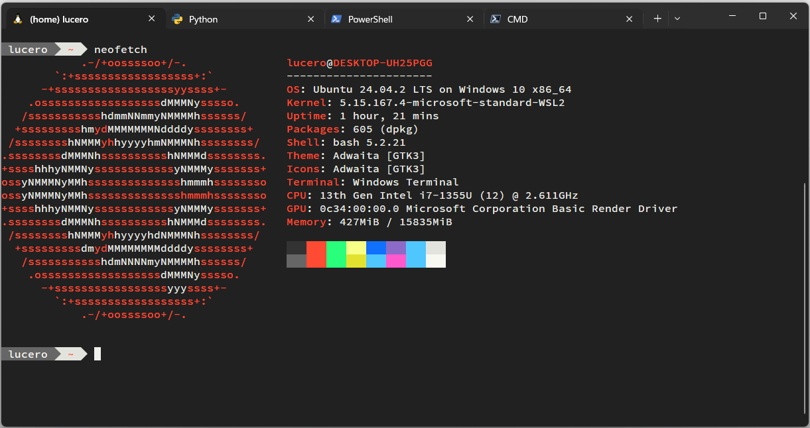

# Windows Terminal - Setup

This repository contains my setup for the [Windows Terminal](https://en.wikipedia.org/wiki/Windows_Terminal), as I almost exclusively use WSL on Windows and find the built-in terminals for WSL, Python, Powershell, and CMD really ugly and cumbersome.

- Shells/Profiles
    - Defaults to Ubuntu-20.04 ([must be installed with WSL](https://docs.microsoft.com/en-us/windows/wsl/install#install)).
    - Python
    - Powershell
    - CMD
- Global keybindings
    - Similar to the ones I use on [VSCode](https://github.com/lu0/vscode-settings).
        - Tab navigation
        - Pane navigation/resizing
        - Etc.
- Color Scheme
    - Similar to the ones of [my Linux Dotfiles](https://github.com/lu0/dotfiles_linuxMint#terminal) and [my VSCode theme](https://github.com/lu0/vscode-theme-interplanetary-craft).
- Font
    - [Source Code Pro](https://github.com/adobe-fonts/source-code-pro) (must be installed).
- Prompt (WSL profiles only)
    - [My variation of Fancy Bash](https://github.com/lu0/dotfiles_linuxMint/blob/master/bash/fancy-bash.sh) (should be installed within the WSL distro).



## Install

1. Close the Windows Terminal if open.
2. Open powershell.
3. Enter WSL with the `wsl` command
4. Go to the Windows Terminal's settings folder:

    ```sh
    cd "/mnt/c/Users/$(whoami.exe | cut -d'\' -f2 | tr -d '\r')/AppData/Local/Packages/Microsoft.WindowsTerminal_8wekyb3d8bbwe"
    ```

5. Remove the default configuration. NOTE: Make sure to back this up if you have a existing configuration.

    ```sh
    rm -rf LocalState
    ```

6. Clone the repository under `LocalState`

    ```sh
    git clone https://github.com/lu0/windows-terminal-setup LocalState
    ```
    
7. Exit powershell and open the Windows Terminal.
